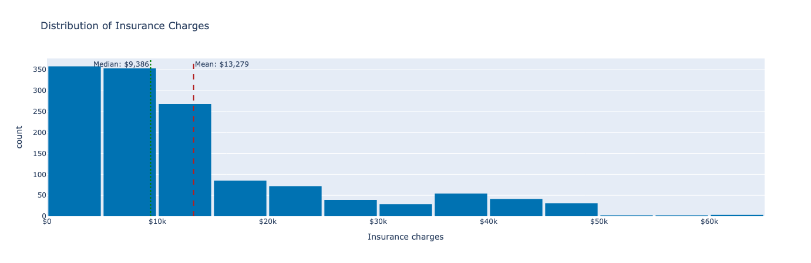
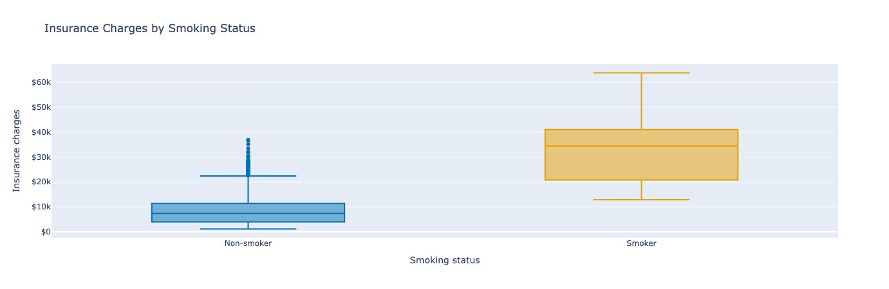
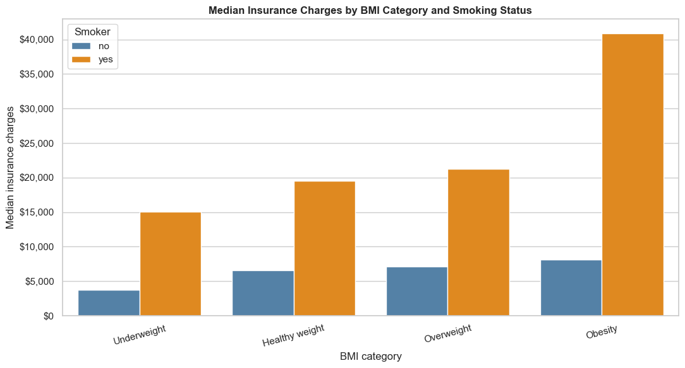
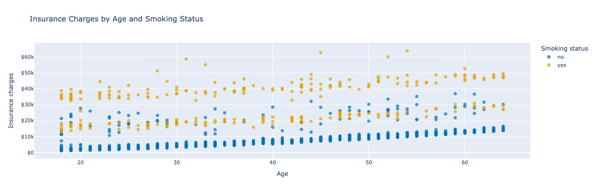
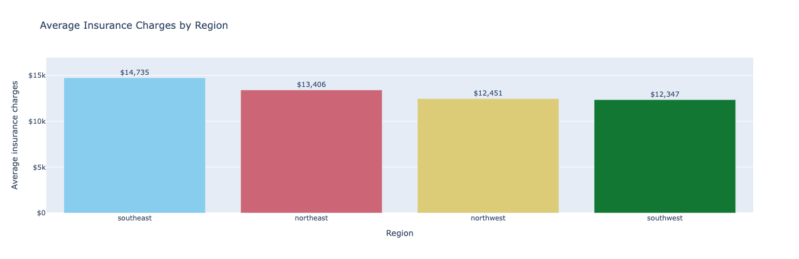
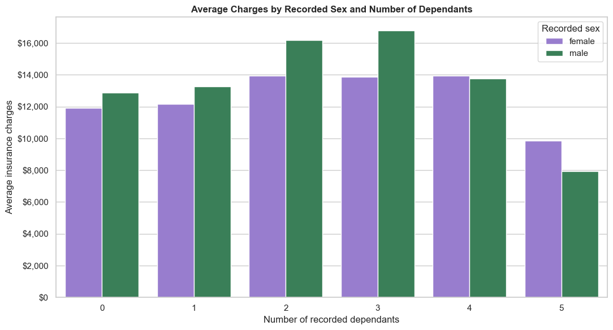
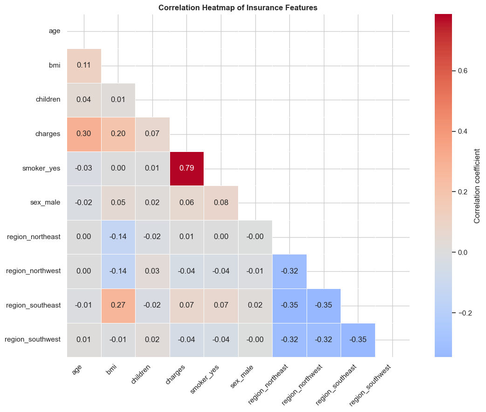
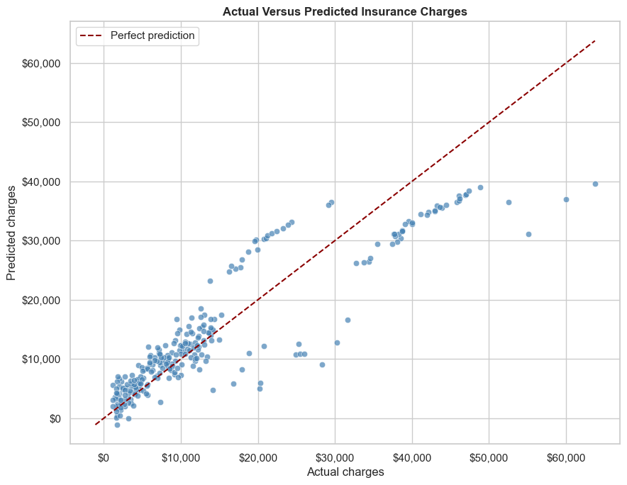

# Healthcare Insurance Cost Analysis

## Table of Contents

- [Project Overview](#project-overview)
- [Business Case](#business-case)
- [Target Audience](#target-audience)
- [Business Requirements](#business-requirements)
- [Dataset](#dataset)
  - [Dataset Storage](#dataset-storage)
- [Applications of Data Analytics and Artificial Intelligence in Healthcare Insurance](#applications-of-data-analytics-and-artificial-intelligence-in-healthcare-insurance)
  - [Relevant Applications of Data Analytics](#relevant-applications-of-data-analytics)
  - [Challenges and Opportunities Addressed by Data Analytics and AI](#challenges-and-opportunities-addressed-by-data-analytics-and-ai)
- [Ethical and Privacy Considerations](#ethical-and-privacy-considerations)
- [Project Structure](#project-structure)
- [Analysis Workflow](#analysis-workflow)
  - [Interactive Plotly Visualisations](#interactive-plotly-visualisations)
- [Visualisation Findings](#visualisation-findings)
  - [Distribution of Charges](#distribution-of-charges)
  - [Smoking Status](#smoking-status)
  - [BMI and Smoking](#bmi-and-smoking)
  - [Age and Charges](#age-and-charges)
  - [Regional Charges](#regional-charges)
  - [Recorded Sex and Dependants](#recorded-sex-and-dependants)
  - [Correlation Analysis](#correlation-analysis)
- [Predictive Analysis](#predictive-analysis)
  - [Model Results](#model-results)
- [Conclusions](#conclusions)
- [Limitations](#limitations)
- [Possible Improvements](#possible-improvements)
- [Technologies Used](#technologies-used)
- [How Data Analytics Addresses the Business Challenge](#how-data-analytics-addresses-the-business-challenge)
- [Running the Project](#running-the-project)
- [Testing and Validation](#testing-and-validation)
- [Credits](#credits)
- [Use of AI Tools](#use-of-ai-tools)
- [Acknowledgements](#acknowledgements)

## Project overview

This project investigates how demographic, lifestyle and geographic
attributes are associated with medical insurance charges.

The project uses Python for data preparation, exploratory analysis,
visualisation and introductory predictive modelling.

## Business case

An insurance analytics team wants to understand the variation in historical
medical charges. The team needs a report showing which recorded attributes
are associated with higher charges and whether the available information
could support an initial cost estimate.

## Target audience

- Insurance data analysts
- Business managers reviewing healthcare-cost patterns
- Data practitioners assessing the suitability of the dataset

## Business requirements

1. Describe the distribution of insurance charges.
2. Investigate how smoking status and BMI are associated with charges.
3. Compare charges across age groups, family sizes, recorded sex and region.
4. Examine relationships between the available variables and charges.
5. Build and evaluate a simple insurance-charge prediction model.
6. Explain the limitations and ethical risks of the analysis.

## Dataset

The project uses the healthcare insurance dataset available from:
[kaggle:Healthcare Insurance](https://www.kaggle.com/datasets/willianoliveiragibin/healthcare-insurance)

The original dataset contains approximately 1338 rows and the following columns:

| Column | Description |
|---|---|
| `age` | Age of the insured person |
| `sex` | Sex category recorded in the source data |
| `bmi` | Body mass index |
| `children` | Number of recorded dependants |
| `smoker` | Recorded smoking status |
| `region` | Broad US residential region |
| `charges` | Individual insurance charges |

### Dataset Storage

- Original data: `data/raw/insurance.csv`
- Processed data: `data/processed/insurance_clean.csv`

The processed dataset was generated by the data collection and cleaning notebook.

## Applications of Data Analytics and Artificial Intelligence in Healthcare Insurance

### Relevant Applications of Data Analytics

Healthcare insurance organisations collect large amounts of information about customers, claims, treatments, policies and financial costs. Data analytics can transform this information into evidence that supports operational and strategic decisions. The main categories of analytics are descriptive, diagnostic, predictive and prescriptive analytics.

Descriptive analytics explains what has happened by summarising historical data through statistics, tables and visualisations. In this project, descriptive analytics is used to examine the distribution of insurance charges and compare charges across smoking status, age, BMI, region, recorded sex and number of dependants. This helps identify patterns and customer groups associated with different levels of historical expenditure.

Diagnostic analytics investigates why a pattern may have occurred by examining relationships between variables. Correlation analysis and grouped comparisons can identify characteristics associated with higher charges. However, this observational dataset cannot demonstrate causation. For example, the strong association between smoking status and charges does not prove that smoking alone caused the recorded costs. Medical history, insurance-plan coverage, treatment prices and other unrecorded variables could also contribute.

Predictive analytics uses historical patterns to estimate an unknown or future outcome. In this project, a linear regression model estimates insurance charges from age, BMI, number of dependants, smoking status, region and recorded sex. The model is compared with a median baseline to determine whether the available features provide useful predictive information. Other healthcare-insurance applications could include claims forecasting, customer segmentation, identification of unusual claims and prediction of future financial demand.

Prescriptive analytics goes further by recommending possible actions based on analytical results. For example, aggregated forecasts could support budgeting, staffing or resource planning. Prescriptive decisions in healthcare insurance require particular caution because automated recommendations could affect prices, eligibility or access to services. Such decisions should include professional judgement, legal review, fairness testing and meaningful human oversight. Prescriptive analytics is discussed as a potential application but
is not implemented in this educational project.

### Challenges and Opportunities Addressed by Data Analytics and AI

A central challenge for an insurance organisation is that healthcare charges vary considerably between customers. The distribution is also right-skewed, meaning that a relatively small group of high-charge observations can have a large effect on total expenditure. Data analytics addresses this challenge by organising historical data, measuring differences between customer groups and identifying variables associated with higher costs. These insights could support high-level budgeting, financial forecasting and further investigation.

Artificial intelligence creates opportunities to analyse more complex relationships than a simple linear model can represent. With larger and more representative data,machine-learning models could investigate nonlinear relationships and interactions between age, BMI, smoking status and other factors. AI could also support anomaly detection, claims forecasting and the identification of records requiring professional review. These systems should assist qualified decision-makers rather than make unreviewed customer-level
decisions.

Generative AI can also support the analytical development process. In this project, AI was used for planning, explaining code, debugging, improving the data narrative and cross-referencing the work with the assessment requirements. This review identified that the original notebook had not included the required interactive Plotly visualisations. AI-assisted suggestions were then reviewed, tested and corrected before being included.

The use of data analytics and AI also introduces risks. Historical data may contain bias, incomplete information or groups that are not adequately represented. A model may reproduce these problems or produce results that appear accurate overall while treating particular groups unfairly. Real-world use would therefore require privacy protection, representative data, independent validation, explainability, bias and fairness testing, ongoing monitoring, legal review and human oversight. The analysis in this project is educational
and should not be used for real insurance pricing, eligibility or healthcare decisions.

## Ethical and Privacy Considerations

The dataset does not contain names or direct personal identifiers. However, it contains sensitive characteristics that could contribute to unfair decisions if used irresponsibly.

Important considerations include:

- statistical association does not demonstrate causation
- the recorded sex categories are limited and may not represent gender identity
- protected characteristics must not be used to justify discrimination
- a small educational dataset is not sufficient for real insurance pricing
- real-world use would require privacy, fairness, legal and professional review
- model predictions require meaningful human oversight

## Project Structure

```text
Healthcare-Insurance-Cost-Analysis/
├── assets/
│   └── images/
│       ├── charges-by-age-and-smoking.png
│       ├── charges-by-bmi-and-smoking.png
│       ├── charges-by-region.png
│       ├── charges-by-sex-and-dependants.png
│       ├── charges-by-smoking.png
│       ├── charges-distribution.png
│       ├── correlation-heatmap.png
│       └── model-predictions.png
├── data/
│   ├── raw/
│   │   └── insurance.csv
│   └── processed/
│       └── insurance_clean.csv
├── jupyter_notebooks/
│   ├── Data_Analysis_and_Visualisation.ipynb
│   └── Data_Collection_and_Cleaning.ipynb
├── .gitignore
├── README.md
└── requirements.txt
```

## Analysis Workflow

### Notebook: Data Collection and Cleaning

`Data_Collection_and_Cleaning.ipynb` performs the following work:

1. Loads the original CSV file.
2. Examines the dataset's shape, columns and data types.
3. Checks missing values.
4. Checks duplicate rows.
5. Reviews categorical values.
6. Examines numerical ranges and possible outliers.
7. Standardises column names and category formatting.
8. Removes duplicate records.
9. Creates `age_group` and `bmi_category`.
10. Validates the cleaned data.
11. Saves `insurance_clean.csv`.

High charge values were retained when they appeared plausible because they may represent genuine high-cost customers. Removing them without evidence could hide information important to the business question.

### Notebook: Analysis and Visualisation

`Data_Analysis_and_Visualisation.ipynb`:

1. Loads and verifies the processed data.
2. Examines the distribution of charges.
3. Compares charges by smoking status.
4. Compares BMI categories and smoking status.
5. Examines age and charges.
6. Compares regional averages.
7. Compares recorded sex and number of dependants.
8. creates a correlation heatmap.
9. Trains and evaluates a linear regression model.
10. Presents conclusions and limitations.

### Interactive Plotly Visualisations

The analysis notebook includes four different interactive Plotly graph types:

1. A histogram showing the distribution of insurance charges.
2. A box plot comparing charges by smoking status.
3. A scatter plot examining age, charges and smoking status.
4. A bar chart comparing average charges by region.

These figures support hover details, zooming, panning, legend filtering where
applicable and image downloads through the Plotly modebar. The remaining
Matplotlib and Seaborn figures provide additional static analysis, including
grouped comparisons, the correlation heatmap and model evaluation.

## Visualisation Findings

### Distribution of charges



The insurance charges were strongly right-skewed, meaning that most customers had charges in the lower part of the range, while a smaller number had very high charges. Most recorded charges were approximately between $2,000 and $15,000, with the highest concentration below $10,000. A smaller number of customers had charges above $50,000.

The mean charge was approximately $13,270, while the median was approximately $9,386. The higher mean shows that the relatively small number of high-charge observations pulled the average upward.

### Smoking status



Customers recorded as smokers had considerably higher median charges than non-smokers. The median charge for smokers was approximately $34,456, compared with approximately $7,346 for non-smokers.

Smoking status produced one of the clearest differences in the analysis. The smoker group also had a wider spread of charges, showing greater variation within that group.

### BMI and smoking



Customers with obesity who smoked had the highest median charge, at approximately $41,000. Underweight non-smokers had the lowest median charge, at approximately $3,500–$4,000.

This comparison suggests that examining BMI and smoking status together provides more information than examining either characteristic alone. However, the underweight category contained relatively few customers, and the observed differences do not establish that BMI or smoking caused the charges.

### Age and charges



Charges generally increased with age. The correlation between age and charges was approximately 0.30, indicating a weak positive relationship.

Considerable variation remained between customers of similar ages, particularly between smokers and non-smokers. This shows that age alone could not explain insurance charges.

### Regional charges



The southeast had the highest average charge, at approximately $14,735. The southwest had the lowest average charge, while the northwest had a similarly low average.

Regional differences may reflect differences in smoking status, age, BMI, group size or other unrecorded factors rather than a direct geographical effect.

### Recorded Sex and Dependants



Average charges did not follow a consistent pattern as the number of recorded dependants changed. They generally increased from zero to three dependants, remained at a similar level for four, and then decreased for five dependants.

Males with three dependants had the highest average charge, at approximately $16,700. Males with five dependants had the lowest average, at approximately $7,900.

Differences between the recorded sex categories were moderate and inconsistent. Males had higher averages for zero to three dependants, while females had slightly higher averages for four and five dependants. However, the groups with four and five dependants contained only 25 and 18 customers respectively, so their averages should be interpreted carefully.

### Correlation Analysis



The feature most strongly correlated with charges was `smoker_yes`, with a correlation coefficient of approximately 0.79. This represents a strong positive association between being recorded as a smoker and having higher insurance charges.

Age had a weaker positive correlation of approximately 0.30, while BMI had a correlation of approximately 0.20. Recorded sex, number of dependants and the regional variables had much weaker individual correlations with charges.

`smoker_yes` is the numerical feature created by encoding smoking status, where `yes` is represented by `1` and `no` by `0`.

Correlation measures statistical association and does not establish causation. Other recorded and unrecorded characteristics could contribute to these relationships.

## Predictive Analysis



A linear regression pipeline was created using:

- age
- BMI
- number of dependants
- recorded sex
- smoking status
- region

Categorical variables (sex, smoking status and region) were converted into numerical indicator (0/1) variables so they could be used by the linear regression model. The data was split into 80% training data and 20% test data.

## How Data Analytics Addresses the Business Challenge

Descriptive analytics was used to identify patterns in historical charges across customer groups. Predictive analytics was then used to test whether the available characteristics could estimate charges more effectively than a simple baseline.

These methods could support high-level budgeting and financial forecasting. AI also supported the development and communication workflow, but all outputs required human review and should not be used for automated customer decisions.

### Model Results

| Approach | MAE | RMSE | R² |
|---|---:|---:|---:|
| Median baseline | $9,294 | $14,442 | -0.135 |
| Linear regression | $4,177 | $5,956 | 0.807 |

The linear regression model performed substantially better than the median baseline. Its Mean Absolute Error decreased from approximately $9,294 to $4,177, representing a reduction of more than 50%. Its Root Mean Squared Error was also considerably lower.

The model achieved an R² score of 0.807, meaning that it explained approximately 80.7% of the variation in insurance charges within the test data. In comparison, the baseline had a negative R² score of -0.135, showing that it performed worse than predicting the mean of the test charges.

Although the linear regression model performed well for a simple introductory model, meaningful errors remained. Its MAE indicates that predictions differed from the actual charges by approximately $4,177 on average. The actual-versus-predicted chart also showed that the model underestimated some of the highest charges.

The model is therefore useful as an educational demonstration but is not suitable for real insurance quotations, pricing, eligibility decisions or customer-level decision-making.

## Conclusions

The project found that:

- insurance charges were strongly right-skewed, with most customers having lower charges and a smaller group having substantially higher charges
- smoking status had the strongest association with insurance charges, with smokers having a median charge of approximately $34,456 compared with approximately $7,346 for non-smokers
- charges generally increased with age, although the relationship was relatively weak and age alone could not explain the variation between customers
- BMI provided additional information, particularly when considered together with smoking status. Customers with obesity who smoked had the highest median charges
- the southeast had the highest average regional charge, at approximately $14,735, while the southwest had the lowest average
- recorded sex and number of dependants did not show a consistent overall relationship with charges. Average charges generally increased from zero to three dependants before decreasing at five, while differences between the recorded sex categories varied across the dependant groups
- results for four and five dependants should be interpreted carefully because these groups contained relatively few customers
- the linear regression model substantially outperformed the median baseline and explained approximately 80.7% of the variation in the test charges
- despite its performance, the model continued to make meaningful errors and underestimated some of the highest charges

These findings could support high-level budgeting, financial forecasting and further exploratory analysis by the imaginary insurance business. Smoking status, age and BMI appear to provide the most useful information for understanding differences in charges.

However, the results represent statistical associations rather than causal evidence. They should not be used to make real insurance-pricing, eligibility or healthcare decisions. Any real-world application would require more representative data, independent validation, fairness testing, legal and ethical review, and professional human oversight.

## Limitations

- The dataset is small and may not be representative
- Its collection date and sampling process may be limited or unclear
- Only four broad regions are available
- Important medical, treatment and insurance-plan information is missing
- Smoking is represented by a simple binary category
- Recorded sex is limited to two categories
- The analysis is observational
- Only one regression algorithm and one train-test split were evaluated
- No independent real-world validation was performed

## Possible Improvements

Future development could:

- use larger and more recent data
- apply cross-validation
- compare several regression algorithms
- investigate a transformation of `charges`
- model interactions between BMI, age and smoking
- test model errors across demographic groups
- conduct formal fairness and bias evaluations
- validate the model using independent data

## Technologies Used

- Python
- pandas
- NumPy
- Matplotlib
- Seaborn
- Plotly
- scikit-learn
- Jupyter Notebook
- Visual Studio Code
- Git
- GitHub

## Running the Project

1. Clone the repository and open it in Visual Studio Code.
2. Create a virtual environment:
```bash
python -m venv .venv
```
3. Activate it on macOS or Linux:
```bash
source .venv/bin/activate
```
4. Install the required packages:
```bash
python -m pip install -r requirements.txt
```
5. Select the .venv Python kernel in Visual Studio Code
Run the notebooks in this order:
Data_Collection_and_Cleaning.ipynb
Data_Analysis_and_Visualisation.ipynb

Notebook: Data_Collection_and_Cleaning must run first because it creates the processed CSV used by Notebook: Data_Analysis_and_Visualisation.

## Testing and Validation

The project was tested by:

- restarting and running both notebook kernels from beginning to end
- verifying required columns
- checking missing values and duplicate records
- validating numerical ranges and category values
- confirming that the processed CSV was created
- confirming that Notebook:Data_Analysis_and_Visualisation loaded the processed data
- checking that all charts rendered
- testing hover details, zooming, legend filtering and modebar controls on the
  four interactive Plotly figures
- checking chart interpretations against summary tables
- comparing the regression model with a median baseline
- confirming that no notebook cells produced errors

## Credits

- Dataset: [kaggle:Healthcare Insurance](https://www.kaggle.com/datasets/willianoliveiragibin/healthcare-insurance)
- Learning materials: [Code Institute](https://codeinstitute.net/)
- Python library documentation:
  - [pandas](https://pandas.pydata.org/docs/)
  - [Matplotlib](https://matplotlib.org/stable/)
  - [Seaborn](https://seaborn.pydata.org/)
  - [scikit-learn](https://scikit-learn.org/stable/)
- AI learning assistance: OpenAI Codex, ChatGPT

## Use of AI Tools

 - break the project into manageable stages
 - identify appropriate business requirements
 - explaining the code and debugging
 - structure the narration and data story around the results
 - improve the clarity of the conclusions, limitations and README documentation
 - cross-referencing my project against the assessment requirements
 - reviewing code for possible errors and opportunities for improvement

 Cross-referencing the project with the assessment criteria was particularly useful. This review showed that although my notebook contained several graph types created with Matplotlib and Seaborn, I had completely missed the requirement to include at least three different interactive graph types using Plotly.

After identifying this gap, I added four interactive Plotly visualisations: a histogram, box plot, scatter plot and bar chart. These graphs allow users to explore the results using hover information, zooming, panning and legend controls where applicable.

AI also assisted with converting selected static visualisations to Plotly and identifying that the `nbformat` package was required to display Plotly figures correctly inside the notebook. I reviewed the suggested code, ran the complete notebook and confirmed that all four interactive visualisations rendered without errors.

AI suggestions were treated as recommendations rather than accepted automatically. For example, AI-assisted code for the regional chart initially produced a Matplotlib error. I simplified the implementation, tested it again and checked the result against the underlying summary table.

All interpretations were checked against the actual tables, charts and model results. I remained responsible for understanding the code, deciding which suggestions to use, testing the implementation and ensuring that the final conclusions accurately represented the data.

## Acknowledgements

Thanks to Code Institute, facilitators and learning resources for guidance during this project.
A special thank you to my partner for keeping me sane, motivated and supported throughout this challenging process. Your patience and encouragement helped me keep going, especially when the project felt overwhelming.
